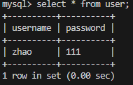

# 1、项目结构
```bash
├── lib                # 输出的库文件
├── bin                # 输出的可执行文件
├── log                # 输出的日志文件
├── resources          # 网页、图片等资源
├── include            # 头文件
├── src                # 源文件
├── .clang-format      # 代码格式化
├── autobuild.sh       # 一键编译脚本
└── README.md          # README文档
```

# 2、编译运行
```sql
mysql -u 用户名 -p    # 登录MySQL，HttpRequest.cpp的userVerify需要改为自己的用户名，密码
create database yourdb; # 创建yourdb数据库
create table user(
    username varchar(20) UNIQUE NOT NULL,
    password tinyint(6) NOT NULL    
);
```
第一次编译运行需要在webserver目录下`先建一个build文件夹`，用于编译。
之后在webserver目录下运行以下命令
```bash
./autobuild.sh   # 编译
cd ./bin
./server 端口号  # 运行服务器
```

# 3、测试结果
## （1）功能
`127.0.0.1:端口号`(最开始是用127.0.0.1:端口号/home，测压时发现测不了，资源路径不对，最后还是建了个index.html)进入首页

点击相应的按钮可以跳转到相应页面

注册

注册成功界面

查看user表



登录

登录成功

输错密码，登录失败


视频播放只能播放部分内容，应该是缓冲区和读写设计有缺陷，不能读大文件。

## （2）webbench测压
[Webbench1.5安装使用Ubuntu](https://blog.csdn.net/weixin_48494235/article/details/141612168?spm=1001.2014.3001.5502)需要先安装webbench工具。

测压出现段错误。根据valgrind测试，在调用回调时访问了非法内存。利用coredump+gdb调试查看了有问题的栈帧，打印了回调函数的量，提示是空对象。在浏览器上直接访问网页，功能正常。应该是（1）线程安全的设计有问题，（2）由于对智能指针和移动语义的用法不熟悉，其中也可能存在误用。
